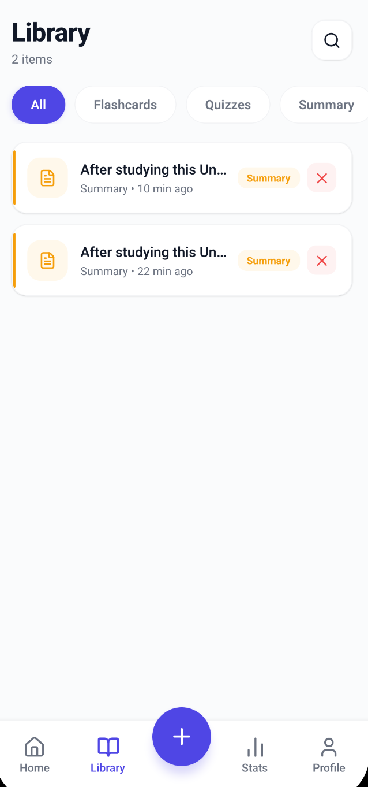
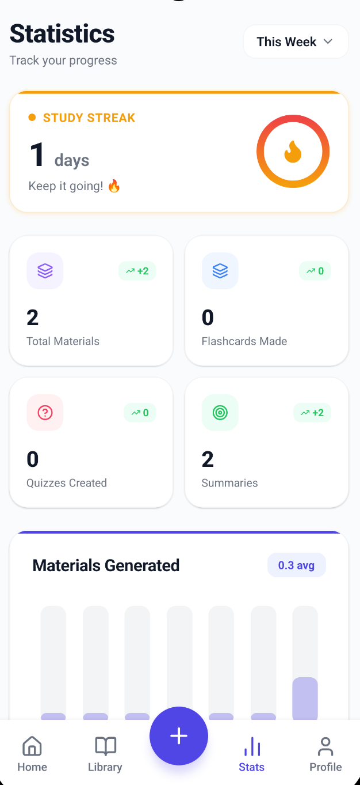
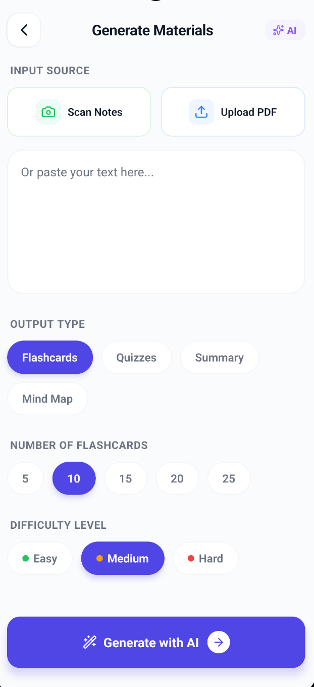

<div align="center">
  
  <h1>📚 StudyBuddy</h1>
  <p><strong>Your AI-Powered Exam Preparation Companion</strong></p>

  <p>
    
    
    
    
  </p>
</div>

---

## 🌟 Overview

StudyBuddy is a mobile application built to help students automatically generate high-quality study materials from their notes and textbooks. Whether you're preparing for board exams or high-stakes competitive entrance tests like **JEE, NEET, or AIIMS**, StudyBuddy acts as your personal AI tutor.

Upload a PDF or snap a picture of your notes, and the app will instantly generate interactive flashcards, quizzes with detailed explanations, and comprehensive summaries.

## ✨ Key Features

- **🧠 Competitive Exam Generation:** Uses the Groq AI API (`llama-3.1-8b-instant`) with carefully engineered prompts to generate NCERT, JEE Main, and JEE Advanced level questions. Features numerical multi-step problems, realistic distractors, and complete step-by-step solutions.
- **⚡ Native On-Device PDF Extraction:** Bypasses slow JavaScript parsers by utilizing a **custom-built Kotlin Native Module** powered by Apache PDFBox. Extracts text from 100+ page PDFs in milliseconds entirely offline, ensuring zero API quota limits on document reading.
- **📸 ML-Kit OCR Integration:** Instantly recognizes text from physical notes using Google's on-device ML Kit.
- **🛡️ Fault-Tolerant AI Chunking:** Intelligently splits massive documents into manageable chunks and feeds them to the LLM. Features built-in resilience, automatically handling API rate limits (`HTTP 429`) with exact exponential backoff, ensuring complete generation without crashing.
- **💾 Cloud Sync with Supabase:** Secure authentication and PostgreSQL database storage so your flashcards and quizzes are always synced across devices.
- **🎨 Fluid UI/UX:** A beautiful, responsive interface featuring Dark/Light mode support, complex layout animations, and custom circular progress SVG graphics for quiz results.

## 🏗️ Technical Architecture

This project was built from the ground up as a **Bare React Native CLI** application (not Expo), allowing for deep native integrations.

### Custom Native Modules
A major technical challenge was the performance bottleneck of parsing PDFs in the JavaScript thread. To solve this, a custom Android native module was written in Kotlin:
- **`PdfTextExtractorModule.kt`**: Bridges React Native to the `pdfbox-android` library. It loads the PDF stream directly from the Android URI, loops through pages natively on a background thread, and resolves a highly optimized string array back to JS.

### AI Integration & Rate Limit Handling
To generate study materials without bankrupting API limits on large texts:
1. **Extraction:** Native code grabs raw text (Free & Offline).
2. **Chunking:** `chunkingService.ts` safely splits text by sentence boundaries into 3000-character segments.
3. **Processing Loop:** `aiService.ts` fetches from the Groq API sequentially. It parses retry-headers to perfectly time delays and gracefully skips chunks that fail JSON validation, guaranteeing the app never crashes during a long generation process.

## 🚀 Getting Started

### Prerequisites
- Node.js (v18+)
- Android Studio / Android SDK
- Ruby & CocoaPods (for iOS)
- Supabase Account
- Groq API Key

### Installation

1. Clone the repository:
   ```bash
   git clone https://github.com/Monaswi0104/StudyBuddy.git
   cd StudyBuddy
   ```

2. Install dependencies:
   ```bash
   npm install
   ```

3. Setup Environment Variables:
   Create a `.env` file in the root directory:
   ```env
   GROQ_API_KEY=your_groq_api_key
   SUPABASE_URL=your_supabase_url
   SUPABASE_ANON_KEY=your_supabase_anon_key
   ```

4. Run the app:
   ```bash
   # For Android
   npm run android

   # For iOS
   cd ios && pod install && cd ..
   npm run ios
   ```

## 📱 Screenshots

<div style="display: flex; flex-direction: row; flex-wrap: wrap; justify-content: center; gap: 10px;">
  
  
  
  
  
  
  
  
</div>

## 🛠️ Built With
- [React Native](https://reactnative.dev/)
- [Supabase](https://supabase.com/)
- [Groq](https://groq.com/) (Llama 3.1)
- [Apache PDFBox](https://pdfbox.apache.org/) (Android Native)
- [Google ML Kit](https://developers.google.com/ml-kit) (React Native ML Kit)
- [Lucide Icons](https://lucide.dev/)

---
<div align="center">
  <i>Designed and developed as a portfolio project demonstrating Native Module bridging, LLM orchestration, and modern React Native architecture.</i>
</div>
